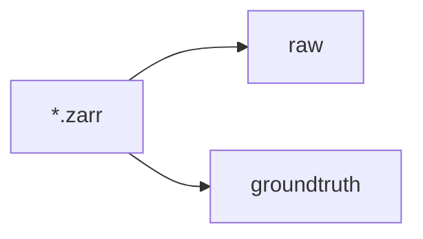

<h2 align="center">Unsupervised Learning of Object-Centric Embeddings  for Cell Instance
Segmentation in Microscopy Images</h2>

## Table of Contents

- **[Introduction](#introduction)**
- **[Dependencies](#dependencies)**
- **[Getting Started](#getting-started)**
- **[Training & Inference on your data](#training-and-inference-on-your-data)**
- **[Issues](#issues)**
- **[Citation](#citation)**
- **[Acknowledgements](#acknowledgements)**


### Introduction
This repository hosts the version of the code used for the **[preprint]()** **Unsupervised Learning of Object-Centric Embeddings for Cell Instance
Segmentation in Microscopy Images**. 

We refer to the techniques elaborated in the publication, here as **Cellulus**. `Cellulus` is a method to perform instance-segmentation of objects in microscopy images in an unsupervised fashion i.e. requiring no ground truth labels during training. 

With `Cellulus`, we obtain state-of-the-art results on multiple real-world microscopy datasets. 

### Dependencies 
We have tested this implementation using `cudatoolkit` version 11.7 on a `linux` OS machine. 
One could execute these lines of code to run this branch:

```
conda create -n cellulus-env python=3.9
conda activate cellulus-env
conda install pytorch torchvision pytorch-cuda=11.7 -c pytorch -c nvidia
git clone https://github.com/funkelab/cellulus.git
cd cellulus
pip install -e .
pip install git+https://github.com/funkelab/funlib.learn.torch
```

### Getting Started

Look in the `examples` directory,  and try out the `Immune` notebook for 2D images or `Simulated-3D` notebooks for volumetric (3D) images. 

### Training and Inference on your data
   
`train.zarr`, `val.zarr` (optional) and `test.zarr` type files should be present.
These should contain `raw` (raw image files) and `groundtruth` (optional) (ground truth instance label masks, which are used for evaluation).



### Issues

If you encounter any problems, please **[file an issue]** along with a description.

[file an issue]: https://github.com/funkelab/cellulus/issues


### Citation

If you find our work useful in your research, please consider citing:

```bibtex

```


### Acknowledgements

